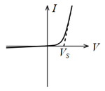
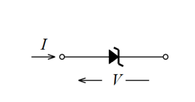
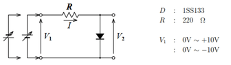

- [６．ダイオードの特性と整流回路](#６ダイオードの特性と整流回路)
  - [1.目的](#1目的)
  - [2. 解説](#2-解説)
    - [2.2 ダイオード](#22-ダイオード)
    - [2.2 整流回路](#22-整流回路)
  - [3 使用機器](#3-使用機器)
    - [3.1 持参するもの](#31-持参するもの)
  - [4. 実験方法](#4-実験方法)
    - [4.1 ダイオードの電圧ー電流特性](#41-ダイオードの電圧ー電流特性)
    - [4.2 半波整流回路](#42-半波整流回路)
    - [4.3 シミュレータを用いた実験](#43-シミュレータを用いた実験)
  - [5. 実験結果](#5-実験結果)
    - [5.1 ダイオードの電圧ー電流特性](#51-ダイオードの電圧ー電流特性)
    - [5.2 半波整流回路](#52-半波整流回路)
    - [5.3 シミュレータを用いた実験](#53-シミュレータを用いた実験)
  - [6. 実験結果に対する考察](#6-実験結果に対する考察)
  - [7. レポートに記載する内容](#7-レポートに記載する内容)
  - [実験を実施する際の注意](#実験を実施する際の注意)
  - [参考文献](#参考文献)
  - [レポート提出のチェックリスト](#レポート提出のチェックリスト)
    - [共通](#共通)
    - [グラフ](#グラフ)
    - [表](#表)
    - [結果と考察](#結果と考察)

# ６．ダイオードの特性と整流回路

## 1.目的 

電子回路に用いられる基本素子の中で能動素子のひとつであるダイオードの特性を測定する．またダイオードの応用回路として整流回路について調べる．

## 2. 解説

### 2.2 ダイオード

N 形または P 形半導体と金属の接合あるいは N 形半導体と P
形半導体の接合をダイオード（diode）とよび， N 形半導体側をカソード，P
形半導体側をアノードとよぶ．
ダイオードの記号は図[1](#fig:ダイオード){reference-type="ref"
reference="fig:ダイオード"}(a)で表され，電流 I と電圧 V の関係は

$$I = I_0 {exp(qV/kT)-1 }$$

で与えられる．ここに $I_0$ はダイオードによって決まる定数で，$k$はボルツマン定数，$T$ は絶対温度， $q$ は電子の電荷量である．

(a)回路記号

(b)特性

図1. ダイオード

式関係をグラフで表すと図1(b)のようになる．ダイオードの電流はアノードからカソードへの一方向にのみ流れ，その逆方向へはほとんど流れない．すなわちダイオードの両端電圧が順方向バイアス（アノードが正，カソードが負）のときは両端電圧は電流が変化してもあまり変らずほぼ一定であり，素子のインピーダンスは低く近似的に短絡状態と見なせる．この時のダイオードの両端電圧 $Vs$ を飽和電圧という．飽和電圧はゲルマニウムダイオードで 0.2V，シリコンダイオードで 0.6～0.7V程度である．またダイオードの両端電圧が逆方向バイアス（アノードが負，カソードが正）のときは両端電圧にかかわらず電流はほとんど流れないので，素子のインピーダンスは高く開放状態と見なせる．
このような性質を利用して，実際の応用回路ではダイオードは検波器や整流器の他， 順方向バイアス時で電流がそれほど大きくない時には両端電圧が $Vs$ にほぼ等しいことを利用して低電圧の直流定電圧が必要な時に用いられる．

ダイオードの逆方向電圧を増加しある値を越えると図2(b)に示すように電流が急激に増加し端子間の電圧はほぼ一定となる．この現象をツェナー効果といい，この電圧 $Vz$ をツェナー電圧という．またこのダイオードをツェナーダイオード（Zener diode）または定電圧ダイオードとよぶ．ツェナーダイオードは流れる電流が変化しても両端の電圧は変らないから電圧が $Vz$ の直流定電圧源として利用できる．

(a)回路記号

(b)特性

図2. ツェナーダイオード

### 2.2 整流回路

ダイオードの電流はアノードからカソードへの一方向にのみ流れ，その逆方向へはほとんど流れないという性質を利用すると，交流から直流を作ることができる．

図3(a)に示すようにダイオードに交流電圧 $v$ をかけると，$v$ が正の時にだけ 電流 $i$ が流れ，$v$ が負の時には電流は流れないので，$v$ に対する $i$ の波形は 図3(b)に示すようになる． 電流 $i$は，その大きさは時間と共に変化するがその符合は常に正で変らない，脈流とよばれる直流の一種となる．このようにダイオードを利用すれば，交流から直流を作ることができる．これをダイオードの整流作用という．図3(a)の回路を半波整流回路とよぶ．

.png)

(a)回路図

_wave.png)

(b)波形

図3.半波整流回路

この回路では脈流は直流成分の他に交流成分を多く含んでいるのでそのままでは実用に適さない．

この交流成分を取り除き，時間的に大きさが変化しない直流を得るためには，例えば図4(a)の回路のように，整流回路の負荷抵抗に並列にコンデンサを接続すればよい．

.png)

(a)回路図

_wave.png)

(b)波形

図4.半波整流回路（整流あり）

この回路の動作は次のようになる．入力電圧が出力電圧より高い期間のみダイオードは導通状態となり順方向に電流が流れ，出力側の負荷抵抗に電流を流すとともにコンデンサを充電する．ダイオードに電流が流れるのは一周期の中のごく僅かな期間である．残りの期間はダイオードは非導通状態となって入力側からは電流は流れないが，負荷抵抗にはコンデンサの放電電流が流れる．コンデンサの容量は十分大きいものとすると，ダイオードが非導通の間のコンデンサの放電電流によるコンデンサ両端の電圧の変化はごくわずかなので，出力側にはほぼ一定の電圧が得られる．しかしこの出力電圧は完全に一定ではなく多少変動する．この変動をリップル（ripple）という．このように，脈流から交流成分を取り除き，直流成分のみを得る回路のことを平滑回路とよぶ．平滑回路としてはリップルをできるだけ小さくすることが望まれる．

## 3 使用機器

1. 可変直流電圧源
2. マルチメータ
3. 正弦波交流信号発生装置
4. オシロスコープ
5. 抵抗（1 Ω，220Ω 2kΩ）
6. 電解コンデンサ（100 $\mu$F 耐圧 50 V）

7. ダイオード（1SS133，RD4.7E）
8. シミュレーションソフトMATLABが利用可能な計算機（各自所有のノートパソコンまたは 大学内の教育用端末）
    使用するツールボックス（アドオン製品）
   - Simulink
   - Simscape Electrical

### 3.1 持参するもの

1. ブレッドボード
2. 測定データ記録およびグラフ描画する端末・機材（電子端末（パソコン等）※またはグラフ用紙（方眼グラフ・片対数グラフ用紙））

※シミュレーションは各個人で実施するため，シミュレーション環境を構築したパソコンを持ち込む必要はない．各自所有のパソコンのシミュレーション環境構築方法は別途指示があるため，その指示に従い，各自で準備すること．

## 4. 実験方法

### 4.1 ダイオードの電圧ー電流特性

図5においてダイオードの両端にかかる電圧 $V$ とダイオードに流れる電流 $I$について以下の2種類の電圧-電流（$V–I$）特性のグラフを作成する．

図5.ダイオード電圧ー電流特性実験回路

- 線形電圧軸-線形電流軸の方眼グラフ
- 線形電圧軸-対数電流軸の片対数グラフ（$I > 0$，$V > 0$の範囲のみ）

用いるダイオードは小信号用ダイオード`1SS133`とツェナーダイオード`RD4.7E`の二種類とする.（入力直流電圧を 10V以上にして各素子に過大な電流を流さないよう注意する）
※グラフを作成しながら測定を行うこと．またグラフの目盛のとり方に注意すること．

1. 図 5 に示す回路をブレッドボード上に実現する．
2. 入力直流電圧 $V_1$ を加え，マルチメータにて電圧 $V_1$，$V_2$ を測定する．電圧 $V_1，V_2$よりダイオードに流れた電流 $I$を計算し，ダイオードの両端にかかる電圧$V$とダイオードに流れる電流$I$をグラフ上にプロットする．
3. 入力直流電圧を 0V～+10Vの間で適当に変化させ，実験を繰り返す．グラフがスムースにつなげるように適切な点数分の測定を繰り返す．
4. 入力の直流電圧源の正負を逆に接続して入力直流電圧を 0V～−10Vまで変化させ，同様に電圧 $V_1，V_2$    を測定し，グラフ上にプロットする．

### 4.2 半波整流回路

半波整流回路（平滑コンデンサあり及びなし）について，入力電圧$v_1$，出力電圧 $v_2$，ダイオードに流れた電流$i(=−v_3)$をオシロスコープで観測して動作を確認，理解する．

1.  図6に示す半波整流回路をブレッドボード上に実現する．ダイオードは小信号ダイオード`1SS133`とする．
2.  図中に示す電圧 $v_1，v_2$をオシロスコープで観測し，記録する（$v_1,v_2$の波形は比較しやすいよう，縦軸・横軸のレンジや基準（GND）を一致させる）．またv1，v3波形を観測し，ダイオードに流れた電流波形および電流が流れている時間を記録する．
3.  図7に示すようにコンデンサを追加し，平滑回路を用いた半波整流回路をブレッドボード上に　実現し，同様の実験を繰り返し，$v_1，v_2，v_3$のオシロスコープの波形を記録する．

.png)

図6.半波整流実験回路

.png)

図7.半波整流実験回路

~~~
コンデンサには極性のあるアルミ電解コンデンサを用いるので，接続方向に注意する．
~~~

### 4.3 シミュレータを用いた実験

4.1 ダイオードの電圧‒電流特性および4.2 半波整流回路について，
シミュレータを用いて同一回路・同一条件下でシミュレーション実験を行い，
シミュレーション結果と測定結果を比較する．ただし，シミュレーションの元となる回路は別途配布する．

シミュレーションに用いるダイオードは1SS133のみとする．
結果を比較しやすくするために，測定結果とシミュレーション結果は同一のグラフに示すこと．
また，平滑化を有する半波整流回路において，抵抗値を変えてシミュレーションを行い，
出力波形がどのように変化するかを観測し，考察する.

## 5. 実験結果

レポートに本実験の結果を以下にまとめること．全て記載されていなければ受理されない．

### 5.1 ダイオードの電圧ー電流特性

1. 2つのダイオード（ISS133,RD4.7E）の測定結果を表で示すこと．
2. ダイオードの電圧-電流特性グラフ（計4つ）を示すこと．2つのダイオード：ISS133,RD4.7Eにおいて，１）縦軸が線形，２）縦軸が対数のグラフ．
3. ダイオードの電圧-電流特性グラフ（縦軸が対数）の傾きを求め，2つのダイオードで比較する．傾きを算出にするために用いた代表2点や計算式を示すこと．

### 5.2 半波整流回路

平滑あり・平滑なしの2つの整流回路において，それぞれ記録する．

1. $v_1,v_2,v_3$波形の記録結果を示す．
2. ダイオードに流れる電流($i=-v_3$)が流れる時間を示すこと．
3. コンデンサを入れることで出力波形がどうして平滑化されるかを，コンデンサにかかる電圧の大きさと充放電の関係から説明する．

### 5.3 シミュレータを用いた実験

1. ダイオードの電圧ー電流特性のシミュレーション結果（縦軸・横軸ともに線形）を示すこと．
2. 半波整流回路（平滑あり）において抵抗$R_L$を変えた$v_1,v_2$波形を示すこと．

## 6. 実験結果に対する考察

1. 2つのダイオード（ISS133,RD4.7E）の特性を比較し，その違いからそれぞれの利点について考察せよ．
2. 実測結果とシミュレーション結果を比較し，シミュレーションの精度について検証せよ．また2つの結果で誤差が生じた理由について考察せよ．
3. 半端整流回路において抵抗値$R_L$が，電圧波形やダイオードに流れた時間に与える要因・原理について考察せよ．  
4. その他，実験結果から考察できることを，全て記載する．

## 7. レポートに記載する内容

レポートには下記の内容を記述すること．ただし，必ずしも下記に記載されている順でなくてもよい．

- 表紙（指定された表紙を使用すること）
- 目的
- 実験方法（指導書通りではなく，簡略化したもので良い）
- 実験結果および考察
- 感想（測定実験・シミュレーションの実施に関する感想）

## 実験を実施する際の注意

1. 本実験では，学生が自らブレッドボード上に素子の配置および配線を行い実験回路を作成する．配線ミス等には十分注意し，実験開始前に自ら十分確認をし，さらに**指導者等の確認を必ず受けること**．
2. 配線ミスによる短絡，素子値の取り違え，方向性のある素子の逆方向接続，測定機器の逆方向接続などにより，
    測定器の破損や異常発熱，素子の異常発熱や焼損および破裂等の事故が起こる可能性があるので，十分注意すること．
3. シミュレーション環境構築やシミュレーション実行時のトラブルや不具合によるレポート提出遅れは，学内の教育用端末が故障等で利用できない場合を除き，認めない．事前にシミュレーション環境構築を行っておくことを推奨する．

## 参考文献

[1] 岩田聡編著，"新インターユニバーシティ電子回路"，オーム社•早原悦朗，"基礎からの電気・電子工学電子回路"，森北出版

[2] 早原悦朗，"電気電子回路 2 電子回路編"，森北出版 

[3] 藤井信生，"なっとくする電子回路"，講談社

## レポート提出のチェックリスト

レポート提出前に，各自チェックリストで確認すること．下記が守られていない場合は再提出となることもある．

### 共通

<input type="checkbox">表紙が付いているか．テンプレートに従っているか（Windows＆word以外：PDF表示したときにテンプレートに従っているか）．

<input type="checkbox">表紙に氏名や学籍番号．共同実験者氏名が正しいか．

<input type="checkbox" >記載すべき項目（7章の項目）が全て記載されているか．

<input type="checkbox">すべての図表が文章に引用されているか（本文中に「図1」や「表1」などと含まれているか）．

<input type="checkbox">文章中に出てくる変数の説明・定義がされているか．

### グラフ

<input type="checkbox">キャプションが入っているか．キャプションの位置は正しい（図の下）か．

<input type="checkbox">縦軸・横軸のラベルや目盛の数値が付いているか．適切な表現となっているか．

<input type="checkbox">測定値はプロットされているか．波形はプロット（マーカー）無しの線で示されているか．

### 表

<input type="checkbox">キャプションが入っているか．キャプションの位置は正しい（表の上）か．

<input type="checkbox">表の枠は適切についているか．

<input type="checkbox">適切な単位([V]や[I])が付いているか．

<input type="checkbox">有効数字が適切か（小数桁が必要以上に多くなりすぎていないか）．

### 結果と考察

<input type="checkbox">単に図表を示すだけでなく，その図表から読み取れることを記述しているか．

<input type="checkbox">結果（実験から読み取れる内容）と考察が区別されているか．

~~~ 例
（結果）実測結果とシミュレーション結果に誤差が生じていた。

（考察）この理由は・・・であると考えられる。
~~~

